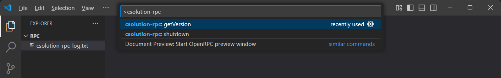

# csolution-rpc-client-example

This example shows how to implement a client for the `csolution-rpc` interface inside a vscode extension.

It uses the Microsoft [vscode-jsonrpc](https://www.npmjs.com/package/vscode-jsonrpc) npm module which is typically the base messaging protocol spoken between a VSCode language server and a client.

## Get started

1. Make sure the [`json-rpc-codegen`](../../codegen/README.md) utility is compiled in this workspace.

2. Generate the client interface file `src/rpc-interface.ts` by calling:
```
npm run gen-rpc-interface
```
3. Inside the editor, open `src/extension.ts` and press F5 or run the command `Debug: Start Debugging` from the Command Palette (Ctrl+Shift+P). This will compile and run the extension in a new Extension Development Host window.

4. Run the `csolution-rpc` commands from the Command Palette (Ctrl+Shift+P) in the new window:



The commands `getVersion` and `shutdown` are currently available in this example.

> :memo: Note: The `csolution` binary must have the RPC server functionality and must be in the system PATH. Install the CMSIS-Toolbox from [nightly artifacts](https://github.com/Open-CMSIS-Pack/cmsis-toolbox/actions/workflows/nightly.yml) or build it in your local environment.